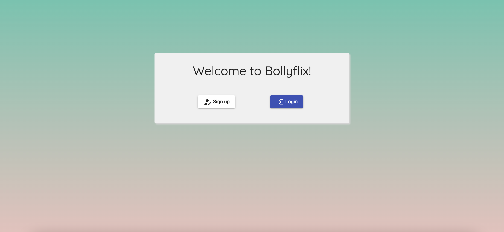
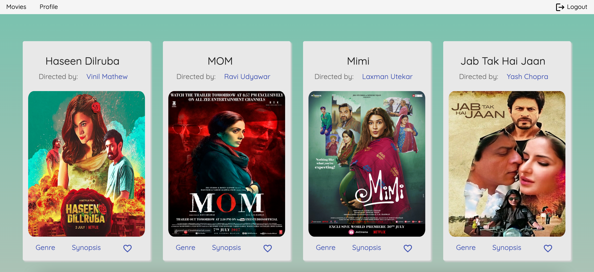

# BollyFlix Angular Client

This project was built using Angular and TypeScript to create a beautiful UI and interact with the REST API on the backend in the 'bolly-flix.movie-api'-repository.

<br>

## Installation

### Install dependencies for this project with npm:

```bash
  git clone https://github.com/LeezaJee/bolly-flix-angular-client.git
  cd bolly-flix-angular-client
  npm install
  
```

<br>

## Development server

Run `ng serve` for a dev server. Navigate to `http://localhost:4200/`. The application will automatically reload if you change any of the source files.

<br>

## Code scaffolding

Run `ng generate component component-name` to generate a new component. You can also use `ng generate directive|pipe|service|class|guard|interface|enum|module`.

<br>

## Build

Run `ng build` to build the project to the corresponding GH pages. The build artifacts will be stored in the `dist/` directory.

<br>

## Features

A user can 
- see all available movies
- get details about the plot, director and genres
- save and delete movies as favorites
- update and delete the user profile

<br>

## Documentation

### Dependencies
**For Development**
- Angular Material
- Angular Router
- Http Client Module

<br>

## Screenshots




<br>

## Demo

You can access the BollyFlix Angular Client App using [this]( https://LeezaJee.github.io/bolly-flix-angular-client/) Project link.

